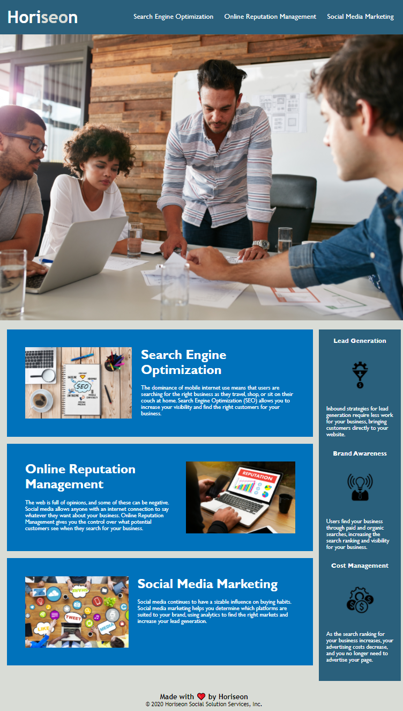

# week-1-homework-html-css

https://jaredweaver.github.io/week-1-homework-html-css/

## User Story

```
AS A marketing agency
I WANT a codebase that follows accessibility standards
SO THAT our own site is optimized for search engines
```

## Acceptance Criteria

```
GIVEN a webpage meets accessibility standards
WHEN I view the source code
THEN I find semantic HTML elements
WHEN I view the structure of the HTML elements
THEN I find that the elements follow a logical structure independent of styling and positioning
WHEN I view the image elements
THEN I find accessible alt attributes
WHEN I view the heading attributes
THEN they fall in sequential order
WHEN I view the title element
THEN I find a concise, descriptive title
```

## Detailed Changes Made


### HTML

- Refactored in semantic HTML elements.
- Ensured all HTML elements follow proper structure.
- Assigned alt attributes to every image and icon.
- Added in a descriptive title.
- Fixed broken "Search Engine Optimization" link.


### CSS

- Combined any CSS selectors that shared the same rules.
- Reassigned any correlating CSS tags to match the elemental changes made in HTML.
- Labled sections of selectors and any rule adjustments worth noting.
- Changed the background color of the aside element to meet WCAG 2 AA contrast ratio thresholds. It now matches the header's background color.


## Resources
- [Accessibility Insights](https://accessibilityinsights.io/docs/en/web/overview/) - used at the end of my refactoring to ensure accessibility standards have been met.

## Screenshot 

